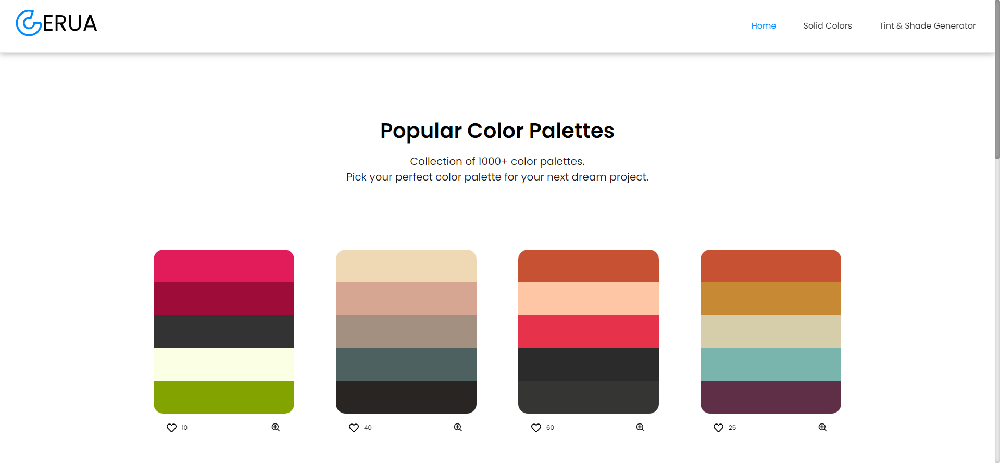

  

## :relaxed:I'm a student at PES University
  - I'm currently learning ReactJS, Firebase :fire:
  - I'm looking to collaborate with other content creators ✋
  - Currently making a guide on python
  - 2023 Goal: Be a backend developer :persevere:
  - Learning Flask and selenium and redis

#### Do fork or star some of my repos :wink:

<!--  -->

  
      <h3 style="display:inline">Projects</h3>
  

<table>
<tr>

<!-- section 1 : gerua-->
<td>

    

    

    
[Gerau Website](gerua.vercel.app)  
[Gerau Repo](https://github.com/SarangKumar/ColorPalette-Gerua)

A color-paletter website that is open to be used by developers and designers in there work.

</td>

<!-- section 2 : coursurf -->
<td>

    

      
    

[Coursurf](https://coursurf.vercel.app/)  
[Coursurf Repo](https://github.com/SarangKumar/coursurf.courses)

A website that helps the user get the description of the course they want in a single go and their description.

</td>

<!-- section 3 : nex-->
<td>

    

    

[NexHunt Website](https://nex-hunt.vercel.app/)
[NexHunt Repo](https://github.com/SarangKumar/NexHunt)

A Site to be used to create an online competition mostly (scavenget hunt) with timer and login feature.

</td>

</tr>

<tr>

<!-- section 4 : gerua-->
<td>

    

    

    
[Gerau Website](gerua.vercel.app)  
[Gerau Repo](https://github.com/SarangKumar/ColorPalette-Gerua)

</td>

<td></td>
<td></td>

</tr>

</table>

---
<!-- Stats -->
### Statistics

    
     
    
    		  
    

<!-- 

 -->

<!-- Graph -->

  
  ---

### Languages and Tools: 

<!-- Web dev -->
<table>
<tr><td align="center" colspan='4'><strong>Web Development</strong></td></tr>
<tr>
<td align="center" ><strong>Frontend</strong></td>
<td align="center" ><strong>DataBase</strong></td>
<td align="center" ><strong>Backend</strong></td>
<td align="center" ><strong>Testing</strong></td>
</tr>
<tr>
<td></td>
<td></td>
<td></td>
<td></td>
</table>

<!-- React Libraries, Dev & Prod,Utils-->
<table>
<tr>
<td align="center"><strong>React Libraries</strong></td>
<td align="center"><strong>Dev & Production</strong></td>
<td align="center"><strong>Utils</strong></td>
<td align="center"><strong>Creative</strong></td>
</tr>
<tr>
<td></td>
<td></td>
<td></td>
<td></td>
</tr>
</table>

<!-- Programming and Learning -->
<table>
<tr>
<td align="center"><strong>Programming</strong></td>
<td align="center"><strong>Learning</strong></td>
</tr>
<tr>
<td></td>
<td></td>
</tr>
</table>

### Where to find me

  
  
  

---

 

